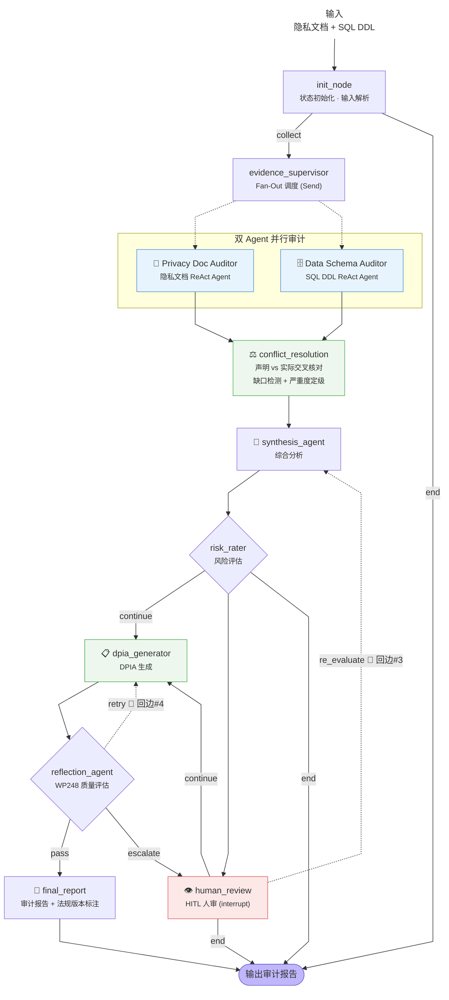

# AI Compliance Audit Agent
*AI-powered multi-agent system for automated GDPR privacy compliance auditing.*  
[](#)
[](#)
[](#)  

---

## 项目简介
基于 LangGraph 的多Agent的GDPR 隐私合规审计智能体。输入隐私声明和数据库Schema/DDL脚本，系统自动完成：双 Agent 并行审计 → "声明 vs 实际"交叉核对 → 风险评估 → DPIA 生成 → 人审复核 → 完整合规报告。通过 2 个 Specialist Agent（一个审计"声明的"、一个读"实际的数据库"），"声明 vs 实际"交叉核对识别合规缺口，确定性规则引擎按 GDPR 罚款梯度定级、EDPB WP248 结构化 DPIA 评分，最终生成带法规版本追踪的审计报告。内置 HITL（Human-in-the-Loop）人审机制，支持 DPO 审批结论。
A LangGraph-powered multi-agent workflow for automated GDPR privacy compliance auditing. It takes privacy policies and database schemas as input, runs two specialist agents in parallel — one extracts what the policy *declares*, the other what the system *actually does* — and cross-checks the two sides to detect policy–practice gaps, it generates EDPB-compliant DPIA reports.

---

## 项目特点

| 特点 | 说明 |
|------|------|
| 🧠 **Multi-Agent 并行审计** | Privacy Doc Auditor + Data Schema Auditor 通过 LangGraph `Send()` API 并行执行，`operator.add` 安全合并结果 |
| ⚖️ **"声明 vs 实际"交叉核对 + 规则引擎定级** | 双 Agent对比声明-实际识别差异（超出声明采集 / 未申报跨境 / 超期保留 / 超授权使用）；`GDPRPriorityEngine`（GDPR 罚款梯度硬编码规则）按严重度定级，LLM 不碰裁决定性，仅同权重情境补判 + 生成解释 |
| 📋 **EDPB WP248 结构化 DPIA 评分** | 7 维度 × 权重 × 硬性标准。风险识别维度（< 0.6）有一票否决权，防止 Reflection Agent 串通作弊 |
| 🔍 **多 Collection 分层 RAG** | ChromaDB 5 个 Collection 按知识类型分库，搜索时加权融合。法规正文权重1.0大于执法案例权重0.7 |
| 🔄 **4 条循环回边（DCG，非 DAG）** | 缺口定级失败→重处理 / 证据补充 / DPO 编辑重评估 / DPIA 反思迭代 |
| 👁️ **HITL 人审（interrupt）** | 基于 LangGraph `interrupt()` 机制，DPO 审批整份结论（Approve / Edit risk_tier / Reject → INCONCLUSIVE） |
| 📅 **法规版本透明展示** | 审计报告 footer 展示三组日期：审计日期 / RAG 构建日期 / 法规版本日期。诚实展示，不做自动"过时"判断 |
| ✅ **引用验证防幻觉** | 每条 finding 引用的 GDPR 条款号（如 Art.7, Art.44）程序化验证是否真实存在，不存在则标记/移除 |

---

## 设计优势

1. **缺口定级不是 LLM 自由发挥** — 先过 `GDPRPriorityEngine`（硬编码罚款梯度），LLM 不碰裁决定性，只做同权重情境补判和写解释。可复现、可审计、低幻觉

2. **DPIA 质量不是 LLM "觉得好不好"** — EDPB WP248 官方量表：7 维度 × 权重 × 硬性标准。风险识别维度 < 0.6 直接一票否决总分归零。Reflection Agent不能用自己的审美评分。

3. **RAG 不是"一个向量库包打天下"** — 5 个 Collection 按知识类型分，搜索加权融合。法规正文权重最高（1.0）大于执法案例只做参考（0.7）。新增文档类型只需加 Collection + 权重，Agent 逻辑零改动。

4. **法规版本不是审计工具说了算** — 审计报告附带"审计日期 / RAG 构建日期 / 法规版本"，不做"过时"判断。合规时效性由 DPO 根据具体场景决定。

5. **LLM 调用是可选的** — 架构支持 mock agent、真实 LLM、或任意组合（27 个测试全部支持 mock 模式）。


## 目录

- [项目架构总览](#项目架构总览)
- [向量数据库架构：ChromaDB + 分层 Collection](#向量数据库架构chromadb--分层-collection)
- [RAG 知识库入库流程](#rag-知识库入库流程)
- [Chunk 分块策略](#chunk-分块策略)
- [RAG 搜索流程](#rag-搜索流程)
- [📊 RAG 检索质量基线](#-rag-检索质量基线)
- [法规版本展示设计](#法规版本展示设计诚实展示不做判断)
- [快速开始](#快速开始)
- [PDF 知识库入库](#phase-a-pdf-知识库入库)
- [项目文件结构](#项目文件结构)

---

## 项目架构总览

### LangGraph 主图流程

> 下图由编译后的 `get_graph().draw_mermaid()` 自动生成。虚线为 4 条循环回边（DCG，非 DAG）， conflict_resolution子图内部的5个节点和2条循环未体现。



### 三层层级

| 层 | 说明 |
|----|------|
| **Layer 1** | 阶段状态机：INIT → EVIDENCE → ANALYSIS → REPORT |
| **Layer 2** | 阶段内部：2 Agent Fan-Out + "声明 vs 实际"交叉核对子图 + HITL + DPIA Reflection |
| **Layer 3** | 每个 Agent 内部的 ReAct 工具循环（LLM Think → Act → Observe） |

### 4 条循环回边（DCG，不是 DAG）

1. 缺口定级失败 → 重处理
2. 证据不足 → 定向 RAG 补充
3. DPO edit → 重评估（回 synthesis_agent）
4. DPIA 质量不达标 → 重生成（回 dpia_generator）

---

## 向量数据库架构：ChromaDB + 分层 Collection

### 类比文件系统

```
ChromaDB（整个向量数据库，存储在 chroma_db/ 目录）
  │
  ├── gdpr_legal_text/          ← Collection（≈ 文件夹）
  │     ├── chunk_001           ← Document（≈ 文件，一条法规文本 + 嵌入向量）
  │     ├── chunk_002
  │     └── ...                 （130 chunks — 来自 GDPR_Regulation_2016_679.pdf）
  │
  ├── edpb_guidelines/          ← Collection（≈ 文件夹）
  │     ├── chunk_001
  │     ├── chunk_002
  │     └── ...                 （819 chunks — 来自 7 份 EDPB 指南 PDF）
  │
  ├── enforcement_cases/        ← Collection（待补充）
  ├── pii_patterns/             ← Collection（待补充）
  └── retention_guidelines/     ← Collection（待补充）
```

### 为什么用 5 个 Collection，而不是 1 个？

**核心设计原则：按知识类型分库，搜索时加权融合。**

| Collection | 内容 | 搜索权重 | 用途 |
|-----------|------|---------|------|
| `gdpr_legal_text` | GDPR 法规正文（Art.1-99） | 1.0（最高） | 确认法律条款原文 |
| `edpb_guidelines` | EDPB 官方指南（WP248 等） | 0.95 | 监管机构解释和指导 |
| `enforcement_cases` | 执法案例和罚款记录 | 0.7 | 风险评估参考（罚款金额） |
| `pii_patterns` | PII 识别模式（正则 + 语义） | 0.8 | 数据表字段扫描匹配 |
| `retention_guidelines` | 数据保留期行业指南 | 0.8 | TTL 合规验证参考 |

- 法规正文（权重 1.0）大于执法案例（权重 0.7），实现"法规正文比执法案例更重要"
- 不同 Collection 的 chunk 元数据不同（法规有 `article`/`chapter`，指南有 `topic`/`guideline_id`），统一 schema 需要大量空字段
- 新增文档类型时只需加 Collection + 权重，零改动已有 Agent 逻辑

---

## RAG 知识库入库流程

### Phase A: PDF → ChromaDB 流水线

```
rag_docs/ 中的 8 份 PDF
       │
       ▼
  PDF 解析 (PyMuPDF / fitz)
  ── 最快的 Python PDF 解析库（C 语言 MuPDF 绑定）
  ── 适用于文本型 PDF
       │
  ┌────┴──────────────────────────────────────┐
  │              分派器 (dispatcher)            │
  │  根据文件名判断文档类型                      │
  │  → 分配到不同的分块策略                      │
  └────┬──────────────────────────────────────┘
       │
  ┌────┴──────────┐      ┌──────────────────┐
  │  GDPR 法规     │      │  EDPB 指南        │
  │  结构化分块     │      │  混合分块策略      │
  │  (按 Article)  │      │  (Section/固定大小)│
  └────┬──────────┘      └──────┬───────────┘
       │                        │
       ▼                        ▼
  ┌──────────────────────────────────────────┐
  │          元数据生成                       │
  │  GDPR: article / chapter / version       │
  │  EDPB: guideline_id / topic / date       │
  └──────────────┬───────────────────────────┘
                 │
                 ▼
  ┌──────────────────────────────────────────┐
  │          批量嵌入 (Batch Embedding)        │
  │  DashScope text-embedding-v3 (1024 维)   │
  │  batch_size=10（避免 API 限频）           │
  └──────────────┬───────────────────────────┘
                 │
                 ▼
  ┌──────────────────────────────────────────┐
  │      ChromaDB 分层入库                    │
  │  gdpr_legal_text (1 份 PDF → 130 chunks)│
  │  edpb_guidelines (7 份 PDF → 819 chunks)│
  │  幂等设计：重复运行不产生重复数据           │
  └──────────────────────────────────────────┘
```

### 入库结果（Phase A 后）

| Collection | 数量 | 来源 |
|-----------|:----:|------|
| `gdpr_legal_text` | **130** | `GDPR_Regulation_2016_679.pdf`（按 Article 分块） |
| `edpb_guidelines` | **819** | 7 份 EDPB 指南 PDF |
| 其他 3 个 Collection | **0** | 待后续阶段补充 |
| **总计** | **949** | — |

---

## Chunk 分块策略

> **Chunk（块）**：RAG 系统中最小的检索单元。一段文本被向量化后存入 ChromaDB，搜索时返回最匹配的 chunk。

### 不同类型文档的 chunk 策略

#### 1. GDPR 法规 — 结构化分块（按 Article 边界）

```
GDPR 全文
  │
  ├── Article 1 ───────────────────── chunk 1
  │     Subject-matter and objectives
  │     "This Regulation lays down rules..."
  │
  ├── Article 2 ───────────────────── chunk 2
  │     Material scope
  │     "This Regulation applies to..."
  │
  └── Article 3 ───────────────────── chunk 3
        ...
```

**为什么？**
- GDPR 有天然语义边界（Article / Chapter / Section），按这些边界切，每块是一条完整法律条款
- 搜索 "Art.44" 能精确返回 Art.44 全文，信息不丢失

**边界情况：** 超长 Article（>2500 字符）按段落再次细分，仍保留 Article 元数据。

#### 2. EDPB 指南 — 混合分块策略

```
尝试检测 Section 编号模式（"1." "2." "3." ...）
  │
  ├─ 成功（≥6 个 section）→ 按 Section 边界切
  │     └─ 每个 section 一个 chunk，语义内聚
  │
  └─ 失败（结构不规律）→ RecursiveCharacterTextSplitter
        └─ chunk_size=800, overlap=100
        └─ 分隔符优先级: \n\n > \n > . > 空格
```

**为什么是混合策略？**
- EDPB 指南不像 GDPR 那样结构统一——有些有清晰编号，有些结构混乱
- "尝试结构化，不行再回退"比"统一用固定大小"更优
- 面试话术：**"根据文档的特点选择分块策略，而不是用一个策略硬套所有文档"**

#### 3. Chunking 参数一览

| 参数 | GDPR 法规 | EDPB（有结构） | EDPB（回退） |
|------|-----------|---------------|-------------|
| 策略 | 按 Article 边界 | 按 Section 编号 | RecursiveCharacterTextSplitter |
| 最小长度 | 200 字符 | 50 字符 | 50 字符 |
| 子分块阈值 | 2500 字符 | 2000 字符 | 800 字符 |
| 子分块粒度 | 1200 字符 | 段落级 | — |
| 重叠 | 无（天然分割） | 无（天然分割） | 100 字符 |

---

## RAG 搜索流程

### 搜索架构

```
Agent 调用:
  search_gdpr_knowledge("consent requirements for marketing")
                           │
                           ▼
                     ┌──────────┐
                     │  遍历所有  │
                     │ Collection│
                     └─────┬────┘
                           │
              ┌────────────┼────────────┐
              ▼            ▼            ▼
        gdpr_legal    edpb_guidelines    ...其他
         _text                         Collection
              │            │            │
              ▼            ▼            ▼
        ┌────────┐   ┌────────┐   ┌────────┐
        │ 语义搜  │   │ 语义搜  │   │ 语义搜  │
        │ 索×1.0 │   │ 索×0.95│   │ 索×0.8 │
        └───┬────┘   └───┬────┘   └───┬────┘
            │            │            │
            └────────────┼────────────┘
                         ▼
                   ┌──────────┐
                   │ 按分数排序  │
                   │ 取 Top-N  │
                   └──────────┘
                         │
                         ▼
                   返回给 Agent
```

### 加权融合（Weighted Fusion）

`search_gdpr_knowledge()` 对上层（Agent）透明：
- 内部遍历所有 Collection
- 每个结果乘以对应 Collection 权重（法规 1.0 > 指南 0.95 > 案例 0.7）
- 跨 Collection 排序，返回 Top-N
- Agent 无需知道数据物理分布

### 嵌入失败回退

当嵌入 API 不可用时（无 API key / 网络错误），自动降级为**关键词匹配**：

```
_semantic_search()
    │
    ├─ 成功 → 返回语义搜索结果
    │
    └─ 失败（嵌入异常）
          │
          ▼
    _keyword_fallback_search()
        │
        └─ 在文档内容和元数据中匹配查询关键词
        └─ 计算关键词命中分数
        └─ 虽然精度较低，但保证流程不断
```

### 元数据过滤

搜索支持精确过滤，无需语义搜索也能精确定位：

```python
search_gdpr_knowledge(
    query="consent",
    filter_article="7",        # 只搜 Art.7
    filter_topic="consent",    # 只搜 consent 主题
    filter_regulation_id="GDPR-2016-679",  # 只搜某个法规
)
```

---

## 📊 RAG 检索质量基线

使用 [RAGAS](https://github.com/explodinggradients/ragas) 对当前 RAG 管道（ChromaDB 949 chunks + text-embedding-v3 + DeepSeek Chat）的 4 项核心指标进行基线评测。

### 基线结果（2026-07-08）

| 指标 | 得分 | 解读 |
|------|:----:|------|
| **context_precision** | 0.64 | 检索到的 chunk 中约 64% 与查询相关，中等水平，可通过增加 Cross-Encoder Reranker 提升 |
| **context_recall** | 0.73 | 全部相关文档中约 73% 被检索到，良好水平，可通过扩展知识库覆盖提升 |
| **faithfulness** | 0.96 | ✅ LLM 回答高度忠实于检索上下文，幻觉率低 |
| **answer_relevancy** | 0.94 | ✅ LLM 生成的回答与问题高度相关 |

### 检索质量辅助指标

| 指标 | 值 |
|------|:--:|
| 空检索率 | 0%（所有 query 均有返回） |
| 条款命中率 | 90%（9/10 期望 GDPR 条款被正确检索） |
| 平均返回 chunk | 5.0 / query |

### 评估设置

- **测试集**: 8 个 GDPR 合规查询（consent, DPIA, 跨境传输, Art.5 原则, 安全措施, 特殊数据, 处理记录, 隐私设计）
- **LLM**: DeepSeek Chat（用于 faithfulness 和 answer_relevancy 评估）
- **嵌入**: text-embedding-v3（1024维）
- **检索**: 每次 Top-5 chunks，跨 5 个 Collection 加权融合

### 重新运行

```bash
cd GDPR_Privacy_Auditor_Agent
python tests/test_ragas_baseline.py
# 结果输出至 outputs/ragas_baseline_report.txt 和 outputs/ragas_baseline_report.json
```

---

## 法规版本展示设计（诚实展示，不做判断）

### 设计理念

审计报告 footer 展示以下信息：

```
本审计截至 2026-06-10 审计，基于 2026-06-09 构建的 RAG 资料和数据的以下法规版本：

  • General Data Protection Regulation v1.0 (生效: 2018-05-25, 最后修订: 2018-05-25)
    - Guidelines on consent v2.1 (2024-05-15)
    - Guidelines on data protection by design v1.0 (2023-12-20)
  • CJEU Judgment — Schrems II v1.0 (生效: 2020-07-16, 最后修订: 2020-07-16)
  • EU-US Data Privacy Framework v1.0 (生效: 2023-07-10, 最后修订: 2023-07-10)
```

**只展示版本，不做"过时"判断。** 原因：

1. **法规时效性很难自动判定** — GDPR 正文自 2018 年生效后未修订，但 EDPB 指南持续更新。一条指南 v2.1 替代了 v1.0，不意味着 v1.0 就是"错的"——具体场景下旧版本仍可能适用。
2. **不同国家的采纳进度不同** — EDPB 指南在欧盟各成员国的法律效力不同，一个统一"过时"标签会误导。
3. **审计工具的角色是透明，不是法官** — 披露审计时使用了什么版本、知识库何时构建，就够了。是否过时、是否需要更新，由 DPO 或合规团队根据具体情况判断。

### 三组日期各司其职

| 日期 | 含义 | 举例 | 谁负责 |
|------|------|------|--------|
| **审计日期** | 审计执行的时间点 | `2026-06-10` | 审计工具（自动） |
| **RAG 构建日期** | 知识库最后一次从 PDF 重建的时间 | `2026-06-09` | 运维人员（运行 `ingest_all_pdfs()` 时记录） |
| **法规版本日期** | 法规/指南自身的版本和生效日期 | `GDPR v1.0 (2018-05-25)` | 法规原文（由 PDF 元数据定义） |

### 类比：论文引用

这和学术论文的参考文献是同样的道理：

- 论文引用一篇 2005 年的论文，不标注"这篇过时了"
- 读者看到引用年份，自然知道这是哪一年的研究成果
- 审计报告同理——列出法规版本，读者自行判断时效性是否满足需求

---

## 快速开始

### 安装依赖

```bash
cd GDPR_Privacy_Auditor_Agent
pip install -r requirements.txt
```

### 配置 LLM API Key

本项目支持任何 OpenAI 兼容 API（无需 OpenAI 账号）：

```bash
# 通义千问（推荐，中文最佳）
export OPENAI_BASE_URL="https://dashscope.aliyuncs.com/compatible-mode/v1"
export OPENAI_API_KEY="sk-your-qwen-key"

# 或 DeepSeek
export OPENAI_BASE_URL="https://api.deepseek.com/v1"
export OPENAI_API_KEY="sk-your-deepseek-key"

# 或 Ollama 本地
export OPENAI_BASE_URL="http://localhost:11434/v1"
export OPENAI_API_KEY="ollama"
```

### 启动 Web 界面（Flask）

```bash
python web_server.py
# 浏览器访问 http://127.0.0.1:5000
```

或双击 `启动审计工具.bat`（Windows）。

### 运行测试

```bash
python -m pytest tests/ -v
```

---

## 知识库PDF文件入库

将 GDPR 法规和 EDPB 指南 PDF 文件放入 `rag_docs/` 目录，然后：

```bash
# 首次入库
python -m rag.ingest

# 强制重新入库（清空旧数据）
python -m rag.ingest --force

# 仅查看文件分配方案（不实际入库）
python -m rag.ingest --dry-run
```
---
## 技术栈

| Layer | Technology | Purpose |
|-------|-----------|---------|
| Workflow Engine | **LangGraph 1.x** (StateGraph) | Multi-agent orchestration, cyclic edges, subgraph, interrupt |
| State Management | Python TypedDict + `operator.add` | Type-safe state with Fan-In merge |
| Vector Database | **ChromaDB 0.5.x** | 5 collections × weighted fusion hybrid search |
| LLM | OpenAI-compatible API (Qwen / DeepSeek / Ollama) | Configurable, no vendor lock-in |
| Embedding | OpenAI-compatible API (text-embedding-v3 / bge-m3) | Configurable, Chinese-friendly |
| PDF Parsing | **PyMuPDF** (fitz) | GDPR/EDPB PDF text extraction |
| SQL Parsing | **sqlparse** + regex | PII column scan and lineage tracking |
| Web UI | **Flask** + vanilla HTML/CSS/JS | Zero external frontend dependencies |
| Testing | **pytest** (27 tests) + **RAGAS** (RAG eval baseline) | E2E scenarios + RAG retrieval quality metrics |

---
---

## 项目文件结构

```
GDPR_Privacy_Auditor_Agent/
├── config.py                  ← LLM / 嵌入 / ChromaDB 配置
├── state.py                   ← 32 字段 TypedDict + 6 个 Enum
├── graph.py                   ← LangGraph 主图（10 nodes, 5 routes, 4 loops）
├── verification.py            ← 引用验证（防 LLM 幻觉）
├── web_server.py              ← Flask Web 界面
├── 启动审计工具.bat            ← Windows 一键启动脚本
├── requirements.txt
│
├── agents/
│   ├── privacy_doc.py         ← Privacy Doc Auditor (ReAct Agent)
│   └── data_schema.py         ← Data Schema Auditor (ReAct Agent)
│
├── subgraphs/
│   └── conflict.py            ← "声明 vs 实际"交叉核对子图（缺口检测 + 严重度定级）
│
├── rules/
│   ├── priority.py            ← GDPRPriorityEngine（条款权重引擎）
│   └── rubric.py              ← DPIAQualityRubric（WP248 7维度量表）
│
├── versioning/
│   └── tracker.py             ← RegulationVersionTracker（版本感知）
│
├── rag/
│   ├── collections.py         ← ChromaDB 5 个 Collection 定义 + 种子数据
│   ├── embed.py               ← 嵌入服务封装
│   ├── search.py              ← RAG 混合搜索（语义 + 关键词 + 加权融合）
│   └── ingest.py              ← Phase A: PDF 入库流水线
│
├── tools/
│   ├── privacy.py             ← Privacy Auditor 4 个工具
│   └── data.py                ← Data Schema Auditor 5 个工具
│
├── hitl/
│   └── review.py              ← HITL 人审节点
│
├── tests/
│   ├── conftest.py
│   ├── test_scenario_a.py     ← 仅文档输入 E2E（5 tests）
│   ├── test_scenario_b.py     ← 文档+SQL 完整链路（22 tests）
│   └── test_ragas_baseline.py ← RAG 检索质量基线评测
│
├── rag_docs/                  ← PDF 源文件（8 份）
├── chroma_db/                 ← ChromaDB 持久化存储目录（.gitignore）
├── templates/
│   └── index.html             ← Flask Web 界面模板
│
└── README.md
```

---

## 面试知识点索引

### LangGraph
- StateGraph + TypedDict — 类型安全的图状态管理
- Send() API — Fan-Out 动态并发
- operator.add — Fan-In 安全合并
- SubGraph — "声明 vs 实际"交叉核对作为独立子图
- interrupt() — HITL 人审中断点
- Conditional Edges — 路由函数控制分支
- Cyclic Edges — 4 条循环回边（不是 DAG）
- InMemorySaver — 状态持久化

### RAG / 向量数据库
- 多 Collection 分层架构 — 按知识类型分库，搜索加权融合
- 结构化分块 vs 语义分块 — 有天然边界的按边界切，没有的按语义切
- 元数据设计 — article/chapter/version 支持版本感知
- Batch Embedding — 减少 API 调用次数
- 幂等性设计 — 重复运行不产生重复数据
- 搜索失败回退 — 嵌入不可用时降级到关键词匹配
- RAGAS 基线评测 — context_precision / recall / faithfulness / answer_relevancy 4 指标

### 法规版本展示
- 诚实展示，不做判断 — 审计报告列出使用的法规版本，由 DPO 自行判断时效性
- 三组日期分离 — 审计日期 / RAG 构建日期 / 法规版本日期，各司其职
- 论文引用类比 — 审计引用法规版本 = 论文引用参考文献，只提供出处不判断新旧
